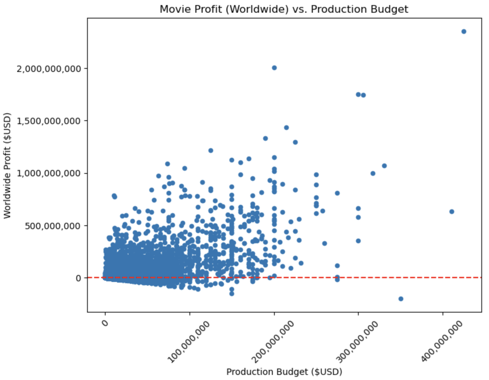

# Blockbusters at the Box Office: Investment Analysis

## Overview

This project focuses on generating statistical insights for movies. Here we are advising a brand new movie studio on how they can begin generating profit. Our analysis will examine movie genres, distribution areas, runtimes, ratings, and budgets to make informed suggestions on what is most likely to succeed.

## Business Problem

Your company now sees all the big companies creating original video content and they want to get in on the fun. They have decided to create a new movie studio, but they don’t know anything about creating movies. You are charged with exploring what types of films are currently doing the best at the box office. You must then translate those findings into actionable insights that the head of your company's new movie studio can use to help decide what type of films to create.

## Data
Our analysis will focus on certain aspects of movies by utilizing data from various sources:

[**Internet Movie Database (IMDb)**](https://www.imdb.com/): user ratings and movie genres 
[**Rotten Tomatoes**](https://www.rottentomatoes.com/): runtime information 
[**The Numbers**](https://www.the-numbers.com/): movie budgets 

We will use these data to gain insight into the following questions:

*__"Which genres are the highest rated?"__*  
*__"How important is a worldwide release for revenue compared to only domestic?"__*  
*__"Is there a relationship between movie length and revenue?"__*  

## Analysis [^1]
We utilized python libraries and modules as well as SQL (pandasql) to generate insights from .csv, .tsv, and .db files. The .db relational database can be seen here:

We performed various statiscal analyses with our data to create the visualizations and results listed below.

## Results

- We can see here that the top genres are: Documentary, News, Biography, Music, and History. Making content that falls into these categories will be more likely to be well received.

- It appears that worldwide releases are imperative to maximize profit and have a higher chance of continued success.

- It appears that movies with a runtime between 2.5 and 3 hours earn significantly more at the Box Office than movies with other runtimes.

## Conclusions
- The highest rated genres are Documentary, News, Biography, Music, and History, followed by Sport, War, Musical, Drama, and Family. Based on our analysis, we recommend these as projects for consideration.

- Worldwide releases are crucial to our bottom line. Movies released eworldwide earn on averqge $50MM more than those only released domestically. Making content geared towards a worldwide release and inclusive of international markets should be a top priority.

- We should focus on "shorts" of less than 30 minutes in length and movies between 2-3hrs in length, as these lengths have been shown to average the highest returns.

[Business Presentation](presentation.pdf)

[^1]:For a full detailed analysis, please reference the [Jupyter Notebook](https://github.com/connoranastasio/dsc-phase-2-project-v3/blob/master/student.pdf) in this repository.
